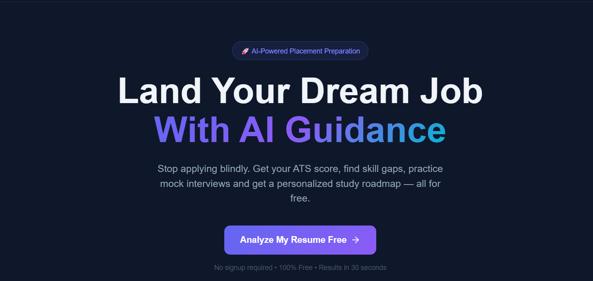
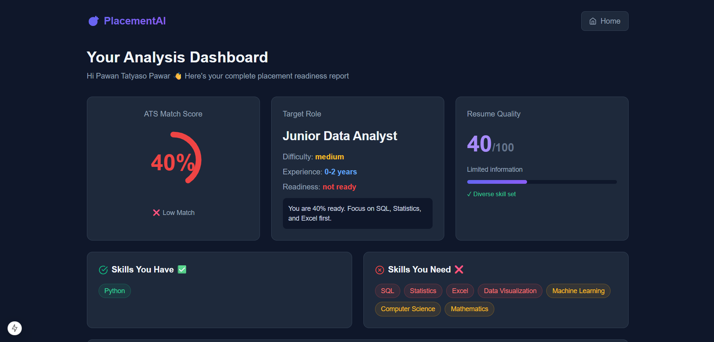
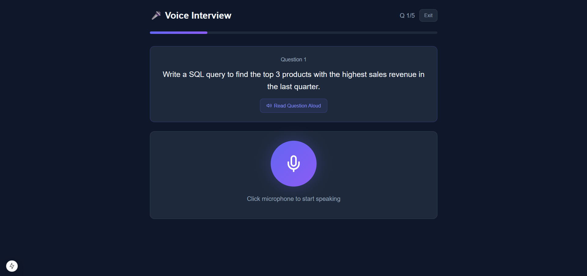

# 🎯 PlacementAI — Autonomous Placement Strategist

<div align="center">


**An end-to-end AI-powered placement preparation system for engineering students.**  
Stop applying blindly. Get your ATS score, find skill gaps, practice mock interviews and get a personalized study roadmap — all for free.

[🚀 Features](#-features) • [🛠️ Tech Stack](#️-tech-stack) • [⚡ Quick Start](#-quick-start) • [📸 Screenshots](#-screenshots) • [🤝 Contributing](#-contributing)

</div>

---

## 🚀 Features

### 🎯 Core Features
| Feature | Description |
|--------|-------------|
| **ATS Score Analysis** | Upload resume + paste JD → instant ATS match score with detailed breakdown |
| **Skill Gap Detection** | AI identifies missing skills ranked by priority with free learning resources |
| **Resume Auto-Rewriter** 🔥 | AI completely rewrites your resume using exact job keywords — watch score jump from 40% to 85%+ |
| **Mock Interview (Text)** | AI-generated questions by difficulty — Easy / Medium / Hard with instant feedback |
| **Voice Mock Interview** 🔥 | Speak your answers just like a real interview — AI evaluates verbal communication |
| **Study Roadmap** | Personalized day-by-day study plan with progress tracking and free resources |
| **Company-Specific Prep** 🔥 | Tailored prep for TCS, Infosys, Google, Amazon and 8+ more companies |
| **Performance Analytics** | Beautiful charts showing ATS score improvement over time |
| **User Authentication** | Signup/Login with secure password hashing — all analyses saved per user |
| **Analysis History** | Every analysis saved — revisit old results with one click |

### 🏆 What Makes Us Different
- ✅ **Resume Auto-Rewriter** — No other tool rewrites your resume for the specific JD
- ✅ **Voice Interview** — Practice speaking, not just typing
- ✅ **Company-Specific Prep** — Different prep for TCS vs Google vs startups
- ✅ **Continuous Improvement** — Analytics track your progress over multiple sessions
- ✅ **100% Free** — No paywalls, no credit card, no subscription

---

## 🛠️ Tech Stack

### Frontend
- **Next.js 14** — React framework
- **Tailwind CSS** — Styling
- **Recharts** — Analytics charts
- **Lucide React** — Icons
- **Axios** — API calls
- **React Hot Toast** — Notifications

### Backend
- **FastAPI** — Python web framework
- **Groq API (LLaMA 3.3 70B)** — Free AI model
- **SQLite + SQLAlchemy** — Database
- **PyPDF2** — Resume PDF parsing
- **Passlib + Bcrypt** — Password security
- **Uvicorn** — ASGI server

### Architecture
```
placement-strategist/
├── backend/
│   ├── agents/
│   │   ├── resume_agent.py       ← Resume analysis
│   │   ├── jd_agent.py           ← Job description parsing
│   │   ├── skill_gap.py          ← Skill gap detection
│   │   ├── interview_agent.py    ← Mock interview Q&A
│   │   ├── roadmap_agent.py      ← Study plan generation
│   │   ├── resume_rewriter.py    ← ATS resume rewriting
│   │   ├── company_agent.py      ← Company-specific prep
│   │   └── auth_agent.py         ← Authentication
│   ├── utils/
│   │   ├── gemini_client.py      ← Groq AI client
│   │   └── pdf_parser.py         ← PDF text extraction
│   ├── database.py               ← SQLite models
│   ├── main.py                   ← FastAPI entry point
│   └── requirements.txt
│
└── frontend/
    ├── app/
    │   ├── page.js               ← Landing page
    │   ├── dashboard/            ← Analysis results
    │   ├── interview/            ← Text mock interview
    │   ├── voice-interview/      ← Voice mock interview
    │   ├── roadmap/              ← Study roadmap
    │   ├── rewriter/             ← Resume rewriter
    │   ├── company/              ← Company prep
    │   ├── analytics/            ← Performance charts
    │   ├── history/              ← Past analyses
    │   └── login/                ← Authentication
    └── utils/
        └── api.js                ← All API calls
```

---

## ⚡ Quick Start

### Prerequisites
- Node.js v20+ → [nodejs.org](https://nodejs.org)
- Python 3.10+ → [python.org](https://python.org)
- Chrome Browser (for voice interview)
- Free Groq API Key → [console.groq.com](https://console.groq.com)

### 1. Clone the Repository
```bash
git clone https://github.com/YourUsername/placement-strategist.git
cd placement-strategist
```

### 2. Setup Backend
```bash
cd backend
python -m venv venv

# Windows
venv\Scripts\activate

# Mac/Linux
source venv/bin/activate

pip install -r requirements.txt
```

### 3. Create Environment File
Create a `.env` file inside the `backend` folder:
```env
GROQ_API_KEY=your_groq_api_key_here
```

Get your free key at [console.groq.com](https://console.groq.com) → API Keys → Create Key

### 4. Start Backend
```bash
uvicorn main:app --reload
```
✅ Backend running at `http://localhost:8000`

### 5. Setup Frontend
Open a **new terminal**:
```bash
cd frontend
npm install
npm run dev
```
✅ Frontend running at `http://localhost:3000`

### 6. Open the App
Go to **http://localhost:3000** in Chrome browser! 🎉

---

## 📸 Screenshots

### 🏠 Landing Page


### 📊 Analysis Dashboard


### 🎤 Voice Mock Interview


### 🏢 Company-Specific Prep


### 📈 Performance Analytics


---

## 🔄 How It Works

```
1. Student uploads resume PDF + pastes job description
         ↓
2. Resume Agent extracts skills, experience, education
         ↓
3. JD Agent analyzes required skills and role details
         ↓
4. Skill Gap Engine compares and calculates ATS score
         ↓
5. Dashboard shows results + improvement suggestions
         ↓
6. Student practices with Mock Interview or Voice Interview
         ↓
7. Roadmap Agent creates personalized study plan
         ↓
8. Resume Rewriter boosts ATS score with keyword optimization
         ↓
9. Analytics tracks improvement over multiple sessions
```

---

## 🎯 Supported Companies

| Company | Type | Difficulty |
|---------|------|-----------|
| TCS | Service | Easy |
| Infosys | Service | Easy |
| Wipro | Service | Easy |
| Cognizant | Service | Easy |
| Accenture | Service | Medium |
| Amazon | Product | Hard |
| Google | Product | Hard |
| Microsoft | Product | Hard |
| Flipkart | Product | Hard |
| Swiggy | Startup | Medium |
| Zomato | Startup | Medium |
| Razorpay | Startup | Medium |

---

## 🔑 Environment Variables

| Variable | Description | Where to Get |
|----------|-------------|--------------|
| `GROQ_API_KEY` | Groq AI API key | [console.groq.com](https://console.groq.com) |

---

## 📦 Backend Dependencies

```
fastapi==0.104.1
uvicorn==0.24.0
python-multipart==0.0.6
PyPDF2==3.0.1
groq==0.4.1
python-dotenv==1.0.0
pydantic==2.5.0
sqlalchemy==2.0.23
bcrypt==4.0.1
passlib==1.7.4
```

## 📦 Frontend Dependencies

```
next: 14
react + react-dom
axios
tailwindcss
recharts
lucide-react
react-hot-toast
```

---

## ⚠️ Troubleshooting

**`venv\Scripts\activate` not working on Windows?**
```bash
.\venv\Scripts\activate
# or use Command Prompt instead of PowerShell
```

**`npm run dev` shows Node version error?**
```
Download Node.js v20 LTS from nodejs.org and reinstall
```

**API returning 429 error?**
```
Your Groq key hit rate limit. Wait 1 minute or create a new key at console.groq.com
```

**Voice interview not working?**
```
Must use Chrome browser. Click "Allow" when browser asks for microphone permission.
```

**Database error on startup?**
```bash
# Delete the database file and restart
rm backend/placement.db
uvicorn main:app --reload
```

---

## 🤝 Contributing

1. Fork the repository
2. Create your feature branch (`git checkout -b feature/AmazingFeature`)
3. Commit your changes (`git commit -m 'Add some AmazingFeature'`)
4. Push to the branch (`git push origin feature/AmazingFeature`)
5. Open a Pull Request

---

## 👥 Team

**Team CodeMavla**
- Built for Higher Education Technology (EdTech) + AI-Driven Career Enablement Hackathon

---

## 📄 License

This project is licensed under the MIT License.

---

## 🙏 Acknowledgments

- [Groq](https://groq.com) — Free and fast LLaMA AI API
- [Next.js](https://nextjs.org) — Amazing React framework
- [FastAPI](https://fastapi.tiangolo.com) — Lightning fast Python API
- [Recharts](https://recharts.org) — Beautiful React charts

---

<div align="center">

**Built with ❤️ by Team CodeMavla**

⭐ Star this repo if it helped you!

</div>
